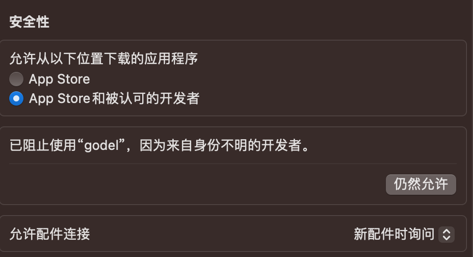

# 安装、配置、运行

## 硬件和软件要求 

- 硬件：4C8G

- 环境要求：java 1.8 和 python3.8 以上执行环境, 请保证 java python 可执行环境

## Sparrow 安装步骤和指导

- CodeFuse-Query 下载包是一个 zip 存档，其中包含工具、脚本和各种特定于 CodeFuse-Query 的文件。如果您没有 CodeFuse-Query 许可证，那么下载此存档即表示您同意 [CodeFuse-Query 条款和条件](../LICENSE)。
- 目前仅支持 mac，linux 系统下使用 CodeFuse-Query，下载地址为:（目前仅给出示例，开源后给出正式下载地址）
   - mac: [CodeFuse-Query 2.0.0](https://github.com/codefuse-ai/CodeFuse-Query/releases/tag/2.0.0)
   - linux: [CodeFuse-Query 2.0.0](https://github.com/codefuse-ai/CodeFuse-Query/releases/tag/2.0.0)
- 您应该始终使用 CodeFuse-Query 捆绑包，确保版本兼容性

### Tips：

- mac系统下直接下载软件包会提示需要验证开发者


- 可在安全性设置中进行修改验证



- 点击仍然允许

- 详细步骤可参照：[Mac 官方文档: 如何在 Mac 上安全地打开 App](https://support.apple.com/zh-cn/HT202491) 

- 或使用`xattr -d com.apple.quarantine`命令，删除 CodeFuse-Query 被 macOS 赋予的外部属性

- `xattr -d com.apple.quarantine`是一个命令行指令，用于删除文件的 `com.apple.quarantine` 扩展属性。该扩展属性是 macOS 系统用来标记从外部来源下载的文件或应用程序的属性，以确保安全性。

```java
xattr -d com.apple.quarantine path/to/file
```

## 配置和初始化 CodeFuse-Query 开发环境

- 解压缩：命令行解压或者直接点一下解压缩即可

- 需要具备 java8 和 python3.8 以上执行环境

- CodeFuse-Query 解压后，您可以通过以下几种方式运行可执行文件来运行 sparrow 进程：

- 通过执行 `<extraction-root>/sparrow-cli/sparrow`，其中 `<extraction-root>` 是提取CodeFuse-Query包的文件夹。

- 通过添加 `<extraction-root>/sparrow-cli` 到您的 PATH，以便您可以直接运行可执行文件 sparrow。

此时，您可以执行 sparrow 命令。

## 运行

### 执行步骤

- 确认需要执行查询的源代码目录

- 抽取源代码的代码数据

- 基于代码数据编写 godel 脚本，获取自己想要的代码数据

- godel 脚本如何编写参照 [GödelScript 查询语言](./4_godelscript_language.md)

### 执行样例

#### 数据抽取
```java
<extraction-root>/sparrow-cli/sparrow database create -s <src> -lang <language> -o <output>
```

- `<output>` 代码库抽取出的代码数据的输出目录，后文数据库位置：`<database>`

- `<language>` 需要进行代码抽取的语言，分析 java 则填写 java

- `<src>` 需要扫描的源代码目录

- 在数据抽取步骤，获得脚本执行需要的数据库 `<database>`

#### 编写godel脚本

- 假设具备如下 godel 脚本, 获取指定仓库的所有 java 方法名

- godel 脚本具体编写可参照 [GödelScript 查询语言](./4_godelscript_language.md)

```java
// script
use coref::java::*

// 定义全局java数据库
fn default_db() -> JavaDB {
    return JavaDB::load("coref_java_src.db")
}

// 遍历所有方法，获取方法名，输出限制
fn getFunctionName(name: string) -> bool {
    let (db = default_db()) {
        for (method in Method(db)) {
            if (name = method.getName()) {
                return true
            }
        }
    }
}


fn main() {
    output(getFunctionName())
}
```

#### 脚本执行
```java
<extraction-root>/sparrow-cli/sparrow query run -d <database> -gdl <gdl_path> -o <output>
```

- `<database>` 需要扫描的代码库抽取出的代码数据，与上文的 `<output>` 一致

- `<gdl_path>` godel 脚本所在路径，可填写所在目录，会依次执行所在目录下所有以`.gdl`结尾的文件

- `<output>` 输出路径目录，xxx.gdl 的执行结果会以 json 格式存入 `<output>/xxx.json` 中

- 可通过查看数据文件确认脚本执行是否正确

#### 例子

若存在以下java代码

```java
public class HelloWorld {
    public static void main(String[] args) {
        HelloWorld tmp = new HelloWorld();
        String hello = tmp.getHello();
        String world = tmp.getWorld();
        System.out.println(hello + " " + world);
    }

    public String getHello() {
        return "Hello";
    }

    public String getWorld() {
        return "World";
    }
}

```

```java
sparrow database create -s <example> -lang java -o ./db/
sparrow query run -d ./db/ -gdl example.gdl -o ./
```

- `<example>` 为上述给出的 java 文件存储目录

- example.gdl 为上述给出的 gdl 示例，存储到当前目录

- 执行完毕后可在当前目录下找到 example.json 文件

对应的脚本输出 json 文件内容如下
```java
[{"name": "getHello"},
{"name": "getWorld"},
{"name": "main"}]

```
